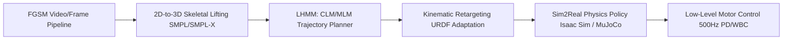
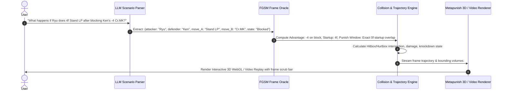

# FGSM & Metapunish: Large Humanoid Movement Model (LHMM) & Visual Scenario Simulation

## Executive Summary
This document outlines the theoretical and architectural roadmap for extending the **Fighting Game Scene Model (FGSM)** beyond frame data extraction into:
1. **Robotics Foundation Modeling (Large Humanoid Movement Model - LHMM)**: Utilizing normalized frame states and causal/masked sequence modeling for humanoid robot locomotion and trajectory generation.
2. **Metapunish Generative Visual Simulation**: An interactive "What-If" engine capable of synthesizing 3D interactive modules, frame-accurate timelines, and video replays in response to natural language player scenarios.

---

## Part 1: Robotics Foundation Theory (LHMM)

### 1.1 The Core Thesis
Human movement and fighting game kinematics share identical structural constraints:
* **Discretized Phase Mechanics:**
  $$\text{Startup (Acceleration)} \longrightarrow \text{Active (Force/Contact)} \longrightarrow \text{Recovery (Deceleration/Reset)}$$
  In humanoid bipedal locomotion, this mirrors the gait cycle:
  $$\text{Heel Strike} \longrightarrow \text{Stance Phase (Active)} \longrightarrow \text{Toe Off} \longrightarrow \text{Swing Phase (Recovery)}$$
* **Collision & Occupancy Primitives:** Hitboxes and hurtboxes in fighting games correspond directly to collision boundaries, end-effector interaction zones, and obstacle clearance bubbles in robotics.

### 1.2 Training Methodology (CLM + MLM)
Movement sequences can be tokenized into discrete spatial-temporal tokens:

```
[Frame t-2] -> [Frame t-1] -> [Frame t] ---> CLM (Autoregressive) ---> [Predicted Frame t+1]
                                    │
[Frame t-1] -> [  MASKED ] -> [Frame t+1] -> MLM (Inpainting)    ---> [Interpolated Frame t]
```

* **Causal Language Modeling (CLM):** Forward trajectory prediction (e.g., predicting the next footstep placement and joint angles from current momentum and balance).
* **Masked Language Modeling (MLM):** Motion interpolation and inpainting (e.g., bridging two distinct poses, obstacle avoidance, trajectory smoothing, and recovery from perturbations).

### 1.3 Architecture: From FGSM to Physical Actuation



1. **High-Level Planner (LHMM @ 10–30 Hz):** Autoregressively plans keyframe kinematic goals from visual/spatial inputs.
2. **Kinematic Retargeter:** Maps canonical 3D human skeletal joint angles to specific robot URDFs (Unitree G1, Boston Dynamics Atlas, Agility Digit).
3. **Low-Level Controller (Whole-Body Controller / RL Policy @ 200–1000 Hz):** Resolves torques, center of mass (CoM), ground reaction forces, and balance.

---

## Part 2: Metapunish Visual "What-If" Scenario Simulation

### 2.1 The Concept
When a user asks a fighting game tactical scenario:
> *"What happens if Ken is -4 on block after Cr.MK, and Ryu retaliates with a 4-frame Light Punch?"*

The system processes the question through an analytical and visual generation pipeline to **synthesize the exact visual outcome** as a 3D interactive model or video clip.

### 2.2 End-to-End System Flow



---

## Part 3: Visual Generation Implementation Modalities

### Modality A: Interactive 3D WebGL Module (Recommended for Metapunish Web)
* **Tech Stack:** Next.js + React Three Fiber / Three.js.
* **Mechanism:**
  * Uses lightweight 3D character rigs/skeletons.
  * Dynamically renders color-coded bounding boxes:
    * **Red:** Active Hitboxes
    * **Green / Blue:** Vulnerable Hurtboxes
    * **Yellow:** Pushboxes / Collision
  * Displays a timeline slider where players can step frame-by-frame (e.g., Frame 1 to Frame 30) and rotate the 3D camera 360 degrees to see micro-spacing.

### Modality B: Deterministic Video Stitching Engine (Server-Side MP4)
* **Tech Stack:** Python (`ffmpeg`, `MoviePy`, `OpenCV`).
* **Mechanism:**
  * Retrieves canonical frame sequences from the `data/ufd/` dataset for Move A and Move B.
  * Offsets start frames by the exact frame advantage ($+2$, $-4$, etc.).
  * Overlays HUD meters, hit spark graphics, and frame counters.
  * Returns an instant 60 FPS MP4 video clip playable inside the Metapunish chat UI.

### Modality C: Generative AI World Model (Neural Video Synthesis)
* **Tech Stack:** Video Diffusion / Video-Language-Action Models.
* **Mechanism:**
  * Conditioned on character states, stage coordinates, and move tokens.
  * Synthesizes photorealistic gameplay footage simulating hypothetical interactions and creative combos.

---

## Part 4: Roadmap & Milestones

| Phase | Milestone | Focus Area | Status |
| :--- | :--- | :--- | :--- |
| **Phase 1** | **FGSM Core Model Training** | VideoMAE Temporal Classifier & Mask2Former Hitbox Segmentation on EC2 GPU | **Current** |
| **Phase 2** | **3D Kinematic Pose & Frame Math Engine** | Extracting 3D spatial keypoints & building deterministic collision simulator | Up Next |
| **Phase 3** | **Metapunish Interactive 3D WebGL Replay** | React Three Fiber 3D scenario viewer in Metapunish Frontend | Planned |
| **Phase 4** | **LHMM Robotics Foundation Model** | CLM/MLM pretraining on motion tokens + Sim2Real physics testing in MuJoCo | Planned |
